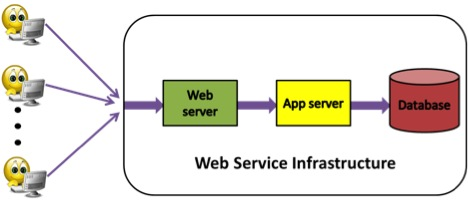
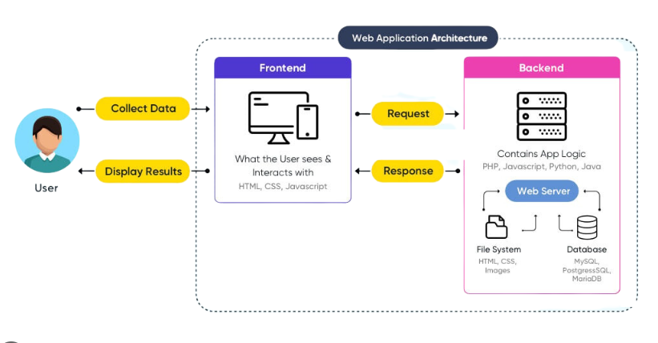
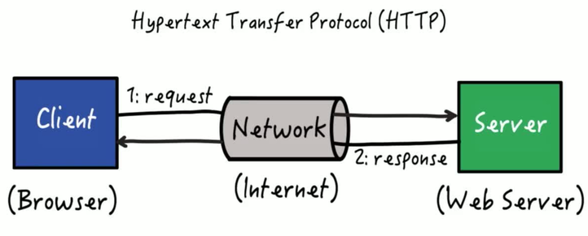
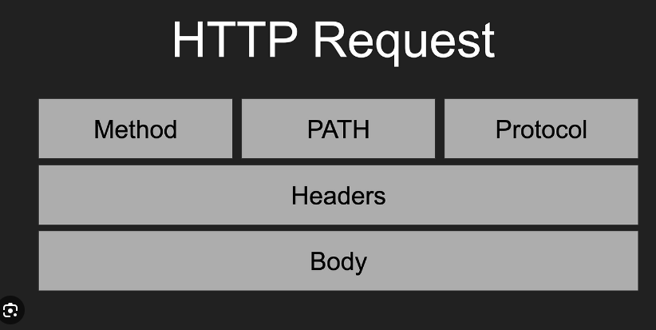
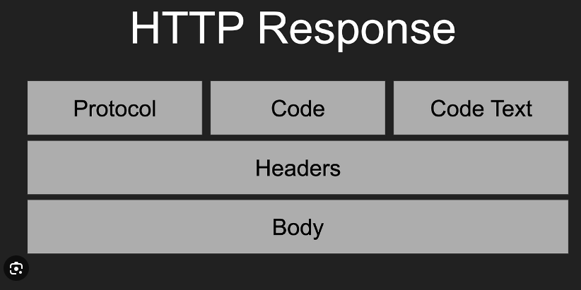
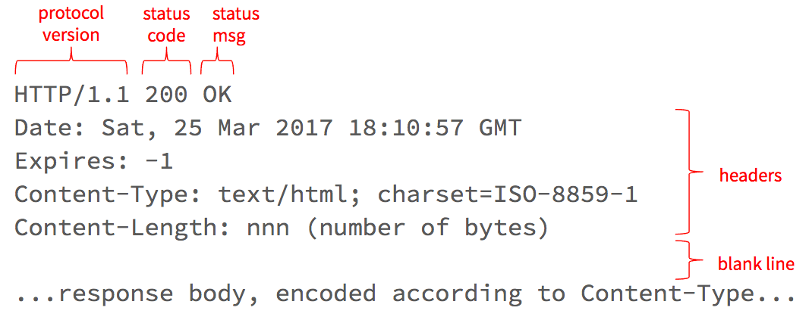

# Applications development

There are multiple project types, some of them are designed to face the user, some other are aimed to be running in the background.

## User facing project.
These are the most common projects since it is the ones that we see on every day as they **need the user's interaction to work** as expected. This category can be divided in 2:

- Web: This type of project is designed to attend several users at the same time, those are published on the internet and are accessed via web explorers (Chrome, Firefox, Internet explorer, etc). 
You should have internet to access them. Examples: Facebook, Instagram, Gmail, WhatsappWeb

- Desktop: This type of applications are designed to attend only one single user. This kind of application is installed locally in the user's computer and you dont need internet to use them. Then an application is installed but in a celphone is called mobile, but it is still this kind of applications. 
Examples: Word, Calculator, Vscode, Outlook, Whatsapp;

## Background processors. 
This kind of applications **does not need the users input to work**, it does not has even an interface for the user, it is usually controlled via commands or configuration values. 
Examples: Antivirus, Backup processes, Data processing.

# Web Apps 

The web applications are generally separated in 2 different groups, the ones that are designed to interact with the user (Front-end) and the ones that are designed to control all the business logic (Front-end). Both published still in the web. 

* **Front-end**: Also called web App, This kind of applications are mainly focused on gather users information, validate data, present information; mainly to give a good experience to the user on the application. Example: Html, Angular, React apps.
* **Back-end**: Also called Web API, this kind of applications are designed to receive information, process it, give a result at the end. Made to contain all the business logic to take desitions and orchestrate the application. Example: C#, Java, Pyhton scripts.

## WEB APIs 
A web api is a type of project that is designed to be published in the internet allowing many other users to execute the code via internet. The communication between the user/front-end and the WebApi is through Http protocol. 

### Request
 
Every time a web resource (Web page or web api) is needed a http request is necessary, because contains all the information necessary to perform the action. Every Http request contains:

* Method: 
	- GET: This method is specifically designed to get a resource (Page or data). This actions is not meant to affect the database. This is the defaul method when it is not specified, also is the one used by the browsers. **Get information**
	- POST: This method is designed to send data to the server to be processed or affect the databas. **Send Information**
	- DELETE: This method is designed to delete information. 
* Path/ Url: This contains the full address of the resource i want to call. Similar to the address from your home when you receive a delivery.
* Headers: Contains internal and more specific information, Will be explained later. 
* Body: Contains extra information that you want to send to the server. This is ofter the information you need to store or process.

	

### Response
 
* Status code: Contains the result of the operation. 
If the Code is between 200 and 300 means it was successful. For more detailed information [See here](https://developer.mozilla.org/en-US/docs/Web/HTTP/Status)
* Code text: The description of status code. 
* Headers: Contains internal and more specific information, Will be explained later. 
* Body: Extra information that the server is returning. This is ofter the information you requested.

	
